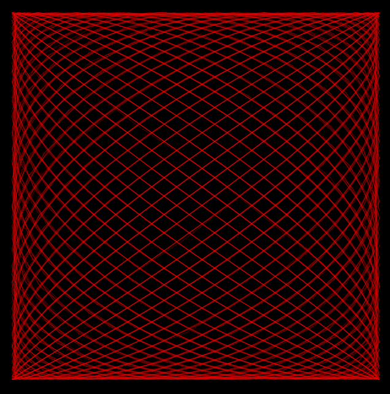

# harmonograph
## Toy app for making mathematical eye candy

You can read about actual harmonographs [here](http://excelunusual.com/wp-content/uploads/2011/01/Harmonograph_Tutorial_2.pdf).
There's also a nice book by Anthony Ashton about these, published by Wooden books.

## TODO
* Allow dynamic manipulation of period in *x* and *y* directions
* Save interesting parameter combinations to a database for later recall
* Other species of harmonograph
